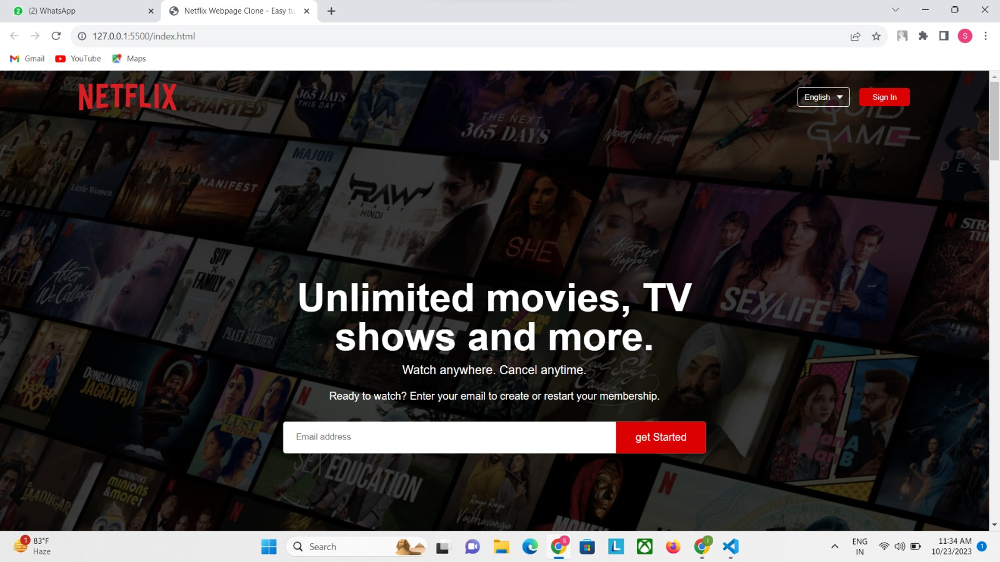

# Netflix Clone Project

Welcome to my Netflix clone project! This project was developed during my internship at Bharat Intern and serves as a practical showcase of my skills in web development, including HTML and CSS.

## Project Overview

This project is a web-based clone of the Netflix platform, designed to replicate its user interface and functionality. It includes the following features:

- Responsive design for various screen sizes.
- Cross-browser compatibility to ensure a seamless user experience.

## Technologies Used

- HTML
- CSS

## Getting Started

To view this project and explore the Netflix clone, you can visit the following link: [Netflix Clone](#)

If you'd like to run the project locally, follow these steps:

1. Clone the repository to your local machine.
2. Open the `index.html` file in your preferred web browser.

## Screenshots

## Project Status

This project is completed and functional. However, I may continue to make improvements and add new features in the future.

## Acknowledgments

I would like to thank Bharat Intern for providing me with the opportunity to work on this project and enhance my web development skills.

Feel free to explore the project and provide any feedback or suggestions. If you have any questions or need assistance, please don't hesitate to reach out.

Thank you for checking out my Netflix clone project!
